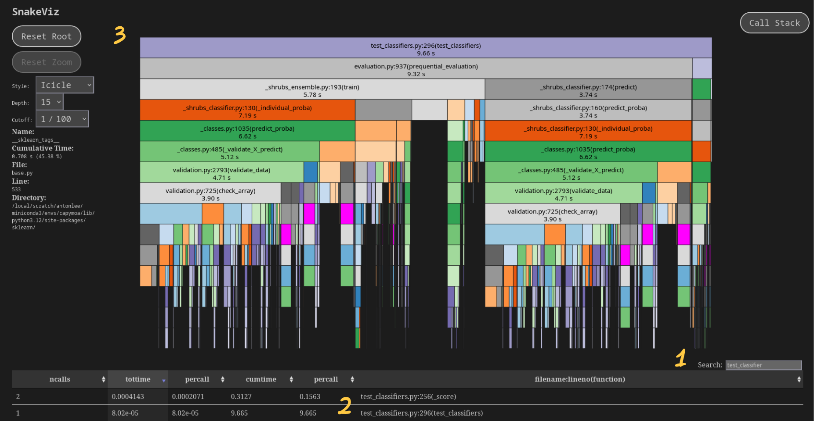
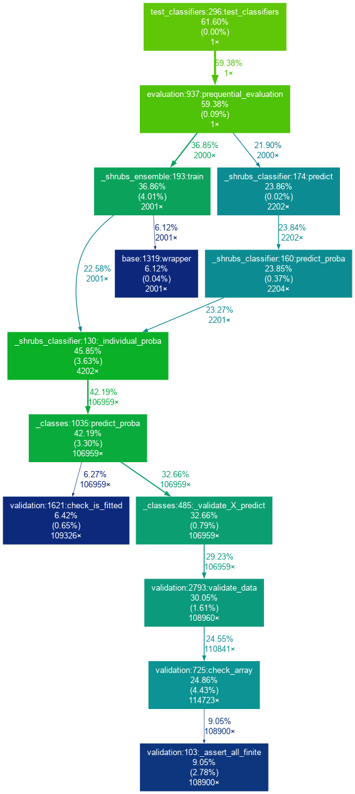

# Performance Profiling

Code profiling is the process of measuring the amount of time a program spends on each function or line of code.
This is used to identify performance bottlenecks and optimise code for better performance.

You can profile any python code with the built-in [`cProfile` module](https://docs.python.org/3/library/profile.html):
```bash
python -m cProfile -o profile.pstats your_script.py
```

In CapyMOA you can do this automatically by adding the `--profile` flag to invoke:
```bash
invoke test.pytest --profile profile.pstats -- tests/test_classifiers.py -k ShrubsClassifier
```

Now we have a profile file we can analyse it.

## Snake Viz
One of the best analysis tools for this is [SnakeViz](https://jiffyclub.github.io/snakeviz/):
```bash
pip install snakeviz
snakeviz profile.pstats
```



1. You can search for the specific function you want to profile.
2. From the table you can click on the function to see a breakdown of the time spent in
   that function and its children. You can hover over the header to get a tooltip with
   more information about the columns.
3. This is flame graph view which shows the time spent in each function and its
   children. The width of each box represents the time spent in that function. It is
   sometimes necessay to fiddle with the depth and cutoff to avoid lag when rendering
   the graph.


## gprof2dot
Another tool for visualising profiles is [gprof2dot](https://github.com/jrfonseca/gprof2dot):
```bash
pip install gprof2dot
gprof2dot -f pstats profile.pstats \
    --root=test_classifiers:296:test_classifiers \
    --node-thres=5 | dot -Tpng -o profile.png
```
* `--root` specifies the function to start the graph from. This is useful for focusing
  on a specific part of the code. It is of the form `module:function:line` and can be
  found in the SnakeViz table.
* `--node-thres` specifies the minimum percentage of time a function must take to be
  included in the graph. This is useful for filtering out noise and focusing on the
  most important functions.




Each node in the visualization follows this structure:


```
+------------------------------+
|        function name         |
| total time % ( self time % ) |
|         total calls          |
+------------------------------+
```

* Total Time: The cumulative percentage of execution time spent within this function and all subsequent functions it called.

* Self Time: The percentage of execution time spent exclusively on this function’s own logic, excluding any time spent in child functions.

* Total Calls: The aggregate count of how many times this specific function was executed during the profile.

## Conclusion

From this profiling we can see that the `ShrubsClassifier` is slowed down by `sklearns`
validation checks which are not necessary in our use case. We can disable them with `.predict_proba(X, check_input=False)` which results in a significant speedup 8s -> 4s.
